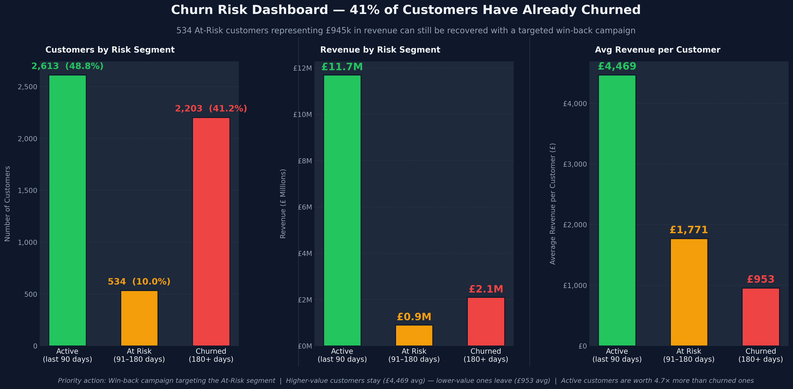
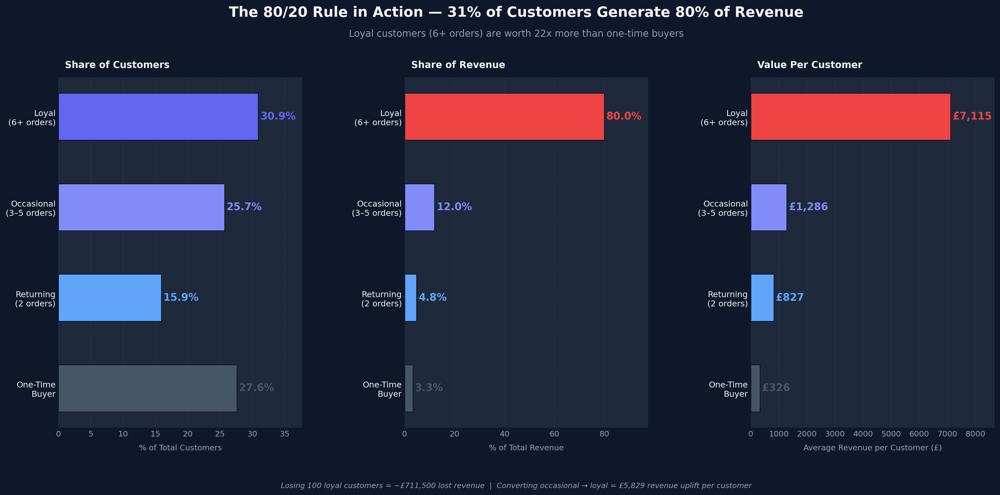
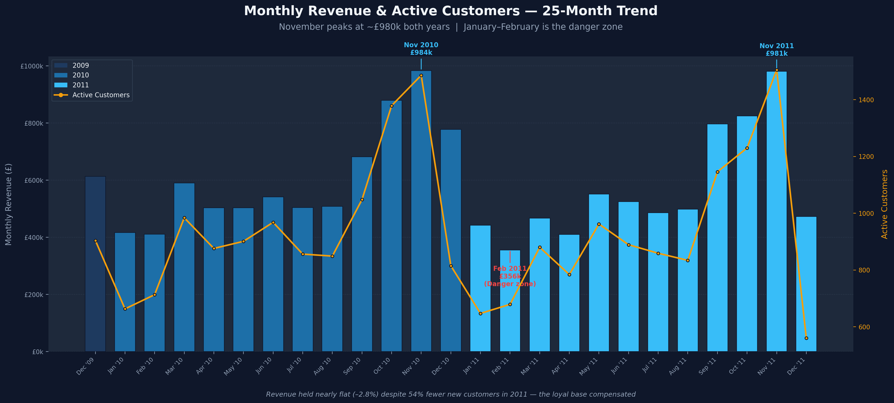
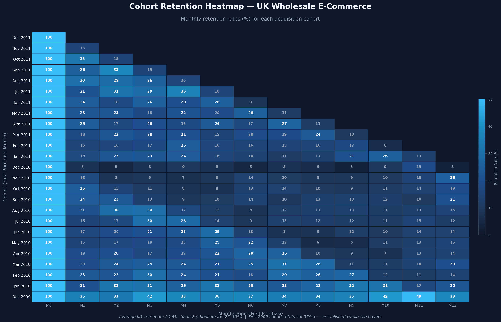

## 📊 Live Dashboard
👉 https://sandu17767.github.io/customer-retention-cohort-analysis/

## 📸 Key Visual Insights

### ⚠️ Churn Risk Segmentation

### 🔥 80/20 Revenue Distribution

### 📈 Monthly Revenue Trend

### 🧠 Cohort Retention Heatmap

---

# 🛒 Customer Retention & Cohort Analysis

**UK Wholesale E-Commerce | Dec 2009 – Dec 2011**

> *"How many customers actually come back — and which ones are about to disappear?"*

---

## 🧭 The Business Problem

A UK-based online wholesale retailer is spending money acquiring new customers with no idea whether those customers ever return. The marketing team has zero visibility into retention. Nobody knows which months bring loyal buyers, which cohorts churn fast, or how much revenue is quietly walking out the door.

This project answers three questions the business needs to act on:

- What percentage of customers return after their first purchase?
- Which customers are about to churn — and how much revenue is at stake?
- Where should the business focus its retention effort right now?

---

## 🗂️ The Dataset

**Source:** UCI Online Retail II — a real UK wholesale e-commerce business
**Raw data:** 1,067,371 transactions across 43 countries
**Date range:** December 2009 – December 2011 (25 months)
**Tools used:** BigQuery (Standard SQL) · Power BI

This is a wholesale/B2B retailer — meaning their customers are shop owners and resellers, not individual consumers. That's important context. Average order value is **£438.90 per order**, which is high for retail but completely normal for wholesale buyers purchasing stock in bulk.

---

## 🧹 Data Cleaning — What Was Removed and Why

The raw dataset had serious quality issues. Nearly a third of all rows were noise that would have corrupted the analysis if left in. Here's exactly what was found and what was removed.

### What the Data Quality Audit Found

| Issue | Rows Affected | What It Means |
|-------|--------------|---------------|
| Missing Customer ID | 243,007 rows (22.8%) | Guest checkouts — no way to track if they return |
| Negative or zero quantity | 22,950 rows | Returns and data entry errors |
| Zero or negative price | 6,207 rows | Free samples, adjustments, or errors |
| Cancellations (Invoice starts with 'C') | 19,494 invoices | Cancelled orders that never shipped |
| Non-UK customers | Filtered out | 43 countries in the dataset — focused on UK only |

### What Was Done About It

- ❌ Removed all rows where Customer ID is null — can't analyse retention without knowing who the customer is
- ❌ Removed all rows where Quantity ≤ 0 — returns and errors aren't real purchases
- ❌ Removed all rows where Price ≤ 0 — free items and pricing errors distort revenue calculations
- ❌ Removed all invoices starting with 'C' — these are cancellations, not completed orders
- ❌ Filtered to United Kingdom only — one market, one currency, one consistent customer base
- ✅ Added a calculated revenue column — Quantity × Price for every line item

### Before vs After Cleaning

|  | Raw Data | Clean Data | Removed |
|--|---------|-----------|---------|
| Total rows | 1,067,371 | 725,250 | 342,121 (32%) |
| Customers | 5,942 | 5,350 | 592 |
| Orders | 53,628 | 33,541 | 20,087 |
| Total Revenue | — | £14,723,147 | — |
| Date Range | — | Dec 2009 – Dec 2011 | 25 months |

> ⚠️ **The biggest red flag:** 243,007 rows — nearly 1 in 4 transactions — had no Customer ID at all. These are guest checkouts. The business literally cannot track, retain, or re-market to nearly a quarter of its buyers. That's not a data problem. That's a business problem. And it's the first thing that needs fixing.

---

## 📊 Key Finding 1 — Only 1 in 5 New Customers Comes Back

After building a full cohort retention matrix across 25 monthly cohorts, the average Month 1 retention rate is **20.6%.**

That means **4 out of 5 customers who make a first purchase never return.**

The industry benchmark for Month 1 retention is 25–30%. This business is falling short. Every month, the marketing team spends budget acquiring customers who disappear after one order.

What the cohort data also reveals:

- **The drop happens immediately.** Retention doesn't gradually decline over months — it collapses right after the first purchase. Customers who do return after Month 1 tend to keep coming back. The problem is the gap between purchase one and purchase two.

- **The December 2009 cohort is a completely different story.** This group retained at 35%+ consistently for two full years — nearly double any other cohort. These are established wholesale buyers who were already loyal when the dataset started. They are the revenue backbone of the business.

- **2011 cohorts retained slightly better** (22.8% M1 average) than 2010 cohorts (19.8%). Retention quality improved — but with far fewer new customers arriving, the overall base is still shrinking.

---

## 💰 Key Finding 2 — 80% of Revenue Comes From 31% of Customers

This is the most important finding in the whole project.

| Customer Segment | Customers | % of Base | Revenue | % of Revenue | Avg Per Customer |
|----------------|-----------|-----------|---------|-------------|-----------------|
| One-Time Buyer | 1,474 | 27.6% | £481,109 | 3.3% | £326 |
| Returning (2 orders) | 848 | 15.9% | £701,070 | 4.8% | £827 |
| Occasional (3–5 orders) | 1,373 | 25.7% | £1,765,940 | 12.0% | £1,286 |
| 🏆 Loyal (6+ orders) | **1,655** | **30.9%** | **£11,775,028** | **80.0%** | **£7,115** |

A loyal customer — someone who has ordered 6 or more times — is worth **£7,115 on average.**
A one-time buyer is worth **£326.**
That's a **22x difference.**

If the business loses 100 loyal customers, it loses roughly **£711,500 in revenue.**
If it loses 100 one-time buyers, it loses £32,600.

The entire retention strategy should be built around protecting and growing the loyal tier — because that's where the business actually lives.

There's also a huge opportunity in the Occasional segment. 1,373 customers are currently spending £1,286 each. Converting even a fraction of them into Loyal buyers through targeted incentives would have a transformational revenue impact.

---

## 🚨 Key Finding 3 — 41% of the Customer Base Has Already Churned

Using each customer's last purchase date measured against the end of the dataset (December 2011):

| Status | Customers | % of Base | Revenue Generated | Avg Per Customer |
|--------|-----------|-----------|-----------------|-----------------|
| 🟢 Active — bought in last 90 days | 2,613 | 48.8% | £11,677,223 | £4,469 |
| 🟡 At Risk — silent for 91–180 days | 534 | 10.0% | £945,541 | £1,771 |
| 🔴 Churned — silent for 180+ days | 2,203 | 41.2% | £2,100,384 | £953 |

More than 4 in 10 customers are already gone.

The group that matters most right now is the **534 At Risk customers.** They haven't churned yet — but they're going quiet. Together they represent **£945,541 in revenue** that is still recoverable with the right outreach at the right time.

Also notice this pattern — Active customers average £4,469 each while Churned customers average only £953. Higher-value customers stay. Lower-value ones leave. Churn isn't random. It's predictable. And that makes it preventable.

---

## 📅 Key Finding 4 — The Business Has a Predictable Seasonal Rhythm

The monthly revenue data tells a very consistent story across both years:

- **October–November is always peak.** November 2010: £983,677. November 2011: £980,646. Nearly identical — wholesale buyers stocking up for the Christmas retail season like clockwork.
- **January–February is always the danger zone.** Revenue drops to £355k–£442k. This is when at-risk customers go quiet and don't come back.
- **December AOV spikes to £602–£669** vs ~£420 the rest of the year. Christmas stock orders are bigger than normal.
- **September marks the start of recovery** each year — the ramp into Christmas begins.

This seasonality is completely predictable, which means it's completely actionable. A win-back campaign timed for January could catch at-risk customers right before they slip into the churn zone.

---

## 🔁 Key Finding 5 — Customers Reorder in the Same Season Every Year

Almost every cohort in the retention matrix shows a spike at exactly Month 12. A customer who first bought in November 2010 came back in November 2011. A customer who bought in October 2010 came back in October 2011.

This is the **anniversary reorder effect** — wholesale buyers replenish their stock at the same time every year. Right now this is happening by chance. Nobody at the business is reaching out proactively.

With an outreach campaign timed 11 months after first purchase, the business could trigger this reorder deliberately — and potentially increase the size of the order at the same time.

---

## ⚠️ Key Finding 6 — New Customer Acquisition Is Collapsing

New customer acquisition fell by **54%** between 2010 and 2011 — from an average of 267 new customers per month down to 122.

Yet full-year revenue only dropped ~2.8%. The loyal base kept revenue stable.

That sounds like good news. It isn't.

The business has no new pipeline. If the existing loyal customers reduce their orders or leave, there is nothing replacing them. The acquisition tap is closing and nobody has noticed because the retention base is temporarily masking the problem. Revenue looks flat today — but it's being propped up by a shrinking group of increasingly valuable customers. That's fragile.

---

## 💡 What the Business Should Do

**Right now (0–3 months)**

1. **Win back the At Risk segment.** 534 customers representing £945k in revenue are going silent. Launch a targeted outreach campaign timed for January–February when the seasonal trough hits. Recovering even 50% = ~£473k in retained revenue.

2. **Protect the loyal base.** Build a VIP programme or dedicated account manager relationship for the top loyal customers. The top 200 by revenue likely represent the majority of that £11.7M. Losing any of them should be treated as a business emergency.

**In the next 3–6 months**

3. **Fix the first-to-second purchase gap.** Create an onboarding sequence for new customers to drive a second purchase within 30 days. Getting M1 retention from 20.6% to 25% on 500 new customers per year = ~£112,000 in additional revenue.

4. **Convert Occasional buyers to Loyal.** Target the 1,373 customers with 3–5 orders with a loyalty incentive. Their average value would jump from £1,286 to £7,115 if they cross the loyalty threshold.

**Strategically (6–12 months)**

5. **Fix the guest checkout problem.** 22.8% of transactions have no Customer ID. Introducing email capture at checkout is the single highest-leverage data improvement available. You can't retain customers you can't see.

6. **Rebuild new customer acquisition.** Revenue stability built entirely on existing customers is fragile. The 54% drop in acquisition needs to be reversed before the loyal base ages out.

---

## 📈 The Dashboard

Four Power BI report pages bring this analysis to life visually.

**Page 1 — Cohort Retention Heatmap**
A colour-coded matrix showing every cohort's retention rate month by month. The darker the cell, the more customers returned. The contrast between the Dec 2009 loyal cohort and newer cohorts is immediately visible.

**Page 2 — Monthly Revenue & Customer Trends**
25 months of revenue and active customer counts side by side. November peaks, January troughs, and December AOV spikes all visible at a glance.

**Page 3 — Customer Segmentation (The 80/20 Visual)**
Two charts side by side — % of customers vs % of revenue by segment. The gap between 30.9% of customers generating 80% of revenue is the centrepiece of this page.

**Page 4 — Churn Risk Dashboard**
Active, At Risk, and Churned customers with revenue at stake. The £945k at-risk figure and the 534 customers who need a win-back campaign are front and centre.

*Dashboard screenshots are in the `/dashboard` folder.*

---

## 🗃️ SQL Queries

All analysis was done in BigQuery Standard SQL using CTEs for readability. Every query runs directly — just swap in your project ID. Queries are in the `/sql` folder and run in order:

| # | Query | What It Does |
|---|-------|-------------|
| 1 | 01_data_quality_audit.sql | Counts nulls, cancellations, negatives — understand what's broken before touching anything |
| 2 | 02_clean_dataset.sql | Removes all noise, filters to UK, adds revenue column — foundation for everything else |
| 3 | 03_cohort_assignment.sql | Assigns every customer to their first-purchase month |
| 4 | 04_cohort_retention_matrix.sql | Builds the full month-by-month retention rate matrix across all 25 cohorts |
| 5 | 05_purchase_frequency_segmentation.sql | Segments customers by order count and calculates revenue per segment |
| 6 | 06_churn_risk_segmentation.sql | Flags every customer as Active, At Risk, or Churned based on recency |
| 7 | 07_monthly_revenue_trends.sql | Month-over-month revenue, orders, active customers, and average order value |

---

**Dataset download:** [UCI Online Retail II](https://archive.ics.uci.edu/dataset/352/online+retail) — free to download, upload to BigQuery to replicate.

---

## 👩‍💻 About This Project

Built by **Sanduni** as Project 1 of a 5-project e-commerce analytics portfolio.

I'm a Data Analyst based in London, building real analytics projects that answer the kind of questions businesses actually care about — not textbook exercises. Every project uses real data, real tools, and delivers real recommendations.

*"I analyse customer and marketing data for e-commerce and retail businesses to improve conversion, retention, and revenue — using SQL, Power BI, and GA4."*

🔗 [LinkedIn](https://www.linkedin.com/in/) · [GitHub Portfolio](https://github.com/)
